# 串行查找和并行查找

## 1. 串行查找 job9/sfind.c

### 1.1 功能

程序 sfind 在文件或者目录中查找指定的字符串，并打印包含该字符串的行，示例如下：

+ 在文件 file.c 中查找字符串 main
  - 找到包含字符串 main 的行
  - 打印文件名和该行

```bash
$ sfind file.c main
file.c: int main(int argc, char *argv[])
```

+ 在目录 test 中查找字符串 main
  - 假设目录 test 下存在文件
    * test/hello/hello.c
    * test/world/world.c
  - 对目录 test 下的所有文件进行查找
  - 找到包含字符串 main 的行
  - 打印文件名和该行

```bash
$ sfind test main
test/hello/hello.c: int main()
test/world/world.c: int main()
```

### 1.2 参考程序

+ 以下程序演示了
  - 如何判断文件类型: 目录还是普通文件
  - 如何遍历目录
  - 如何读取文件的每一行

+ 需要你在它的基础上，完成递归查找

```c
#include <stdio.h>
#include <string.h>
#include <stdlib.h>
#include <dirent.h>
#include <sys/stat.h>
#include <unistd.h>

void find_file(char *path, char *target)
{
    FILE *file = fopen(path, "r");

    char line[256];
    while (fgets(line, sizeof(line), file)) { 
        if (strstr(line, target))
            printf("%s: %s", path, line);
    }

    fclose(file);
}

void find_dir(char *path, char *target)
{
    DIR *dir = opendir(path);
    struct dirent *entry;
    while (entry = readdir(dir)) {
        if (strcmp(entry->d_name, ".") == 0) 
            continue;

        if (strcmp(entry->d_name, "..") == 0) 
            continue;

        if (entry->d_type == DT_DIR) 
            printf("dir  %s\n", entry->d_name);

        if (entry->d_type == DT_REG) 
            printf("file %s\n", entry->d_name);
    }
    closedir(dir);
}

int main(int argc, char *argv[])
{
    if (argc != 3) {
        puts("Usage: sfind file string");
        return 0;
    }

    char *path = argv[1];
    char *string = argv[2];

    struct stat info;
    stat(path, &info);
        
    if (S_ISDIR(info.st_mode))
        find_dir(path, string);
    else
        find_file(path, string);
    return 0;
}
```

## 2. 并行查找 job9/pfind.c

### 2.1 功能

+ 功能与 sfind 相同
+ 要求使用多线程完成
  - 主线程创建若干个子线程
    * 主线程负责遍历目录中的文件
    * 遍历到目录中的叶子节点时
    * 将叶子节点发送给子线程进行处理

  - 两者之间使用生产者消费者模型通信
    * 主线程生成数据
    * 子线程读取数据

### 2.2 图示

+ 主线程创建 2 个子线程
  - 主线程遍历目录 test 下的所有文件
  - 把遍历的叶子节点 path 和目标字符串 string，作为任务，发送到任务队列

+ 子线程
  - 不断的从任务队列中读取任务 path 和 string
  - 在 path 中查找字符串 string



### 2.3 参考程序

```c
#define WORKER_NUMBER 4

struct task {
    int is_end;
    char path[128];
    char string[128];
};

+ 子线程的入口
  - 在一个循环中
  - 从任务队列中，获取一个任务，去执行
  - 当读取到一个特殊的任务(is_end 为真)，循环结束

void *worker_entry(void *arg)
{
    while (1) {
        struct task task;
        从任务队列中获取一个任务 task;
        if (task->is_end) 
            break;
        执行该任务;
        find_file(task->path, task->string);
    }
}

int main(int argc, char **argv[])
{
    char *path = argv[1];
    char *string = argv[2];

    if (path 是一个普通文件) {
        find_file(path, string);
        return;
    }

    1. 创建一个任务队列;
       - 初始化时，任务队列为空

    2. 创建 WORKER_NUMBER 个子线程;

    3. 对目录 path 进行递归遍历:
       - 遇见叶子节点时
       - 把叶子节点的路径加入到任务队列中

    4. 创建 WORER_NUMBER 个特殊任务
       - 特殊任务的 is_end 为真
         * 子线程读取到特殊任务时
         * 表示主线程已经完成递归遍历，不会再向任务队列中放置任务
         * 此时，子线程可以退出
       - 把这些特殊任务加入到任务队列中

    5. 等待所有的子线程结束;
}
```
